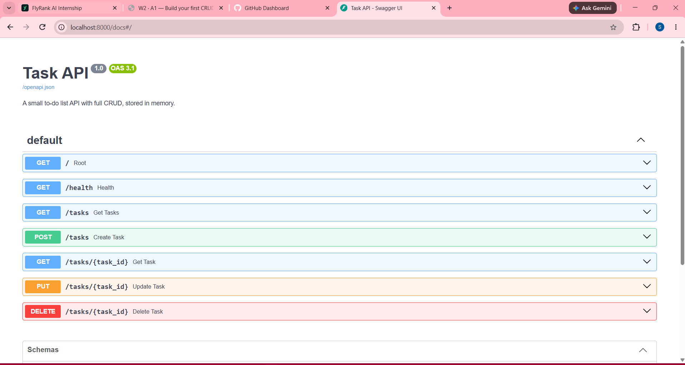

# Task API

A small to-do list API built with **FastAPI** (Python). It supports the four CRUD operations (create, read, update, delete) on tasks, stored **in memory** (no database), and comes with interactive documentation in Swagger UI.

Built for the FlyRank Internship, Backend Track, Week 2, Assignment A1.

## Requirements

- Python 3.10 or newer

## Install and run

```bash
# 1. Clone the repo and enter the folder
git clone https://github.com/Selina2-ctrl/task-api.git
cd task-api

# 2. Create and activate a virtual environment
python -m venv .venv
.venv\Scripts\activate            # Windows (PowerShell)
# source .venv/bin/activate       # macOS / Linux

# 3. Install dependencies
pip install -r requirements.txt

# 4. Start the server
uvicorn main:app --reload
```

The API is now running at <http://localhost:8000>. Interactive docs (Swagger UI) are at <http://localhost:8000/docs>.

> **Note:** tasks live in memory only. Restarting the server resets the list to the 3 example tasks.

## Endpoints

| Method | Path          | Description                           | Success          | Errors   |
| ------ | ------------- | ------------------------------------- | ---------------- | -------- |
| GET    | `/`           | API name, version and endpoints       | 200              |          |
| GET    | `/health`     | Health check                          | 200              |          |
| GET    | `/tasks`      | List all tasks                        | 200              |          |
| GET    | `/tasks/{id}` | Get one task                          | 200              | 404      |
| POST   | `/tasks`      | Create a task from `{"title": "..."}` | 201              | 400      |
| PUT    | `/tasks/{id}` | Update a task's `title` and/or `done` | 200              | 400, 404 |
| DELETE | `/tasks/{id}` | Delete a task                         | 204 (empty body) | 404      |

A task looks like this:

```json
{ "id": 1, "title": "Finish assignment", "done": false }
```

Errors return JSON, for example `{"error": "Task 99 not found"}`.

- **400 Bad Request:** the title is missing or empty, or a PUT body contains nothing to update.
- **404 Not Found:** no task has that id.

## Example request

Fetching a single task with `curl -i` (on Windows PowerShell, use `curl.exe`):

```bash
curl -i http://localhost:8000/tasks/1
```

Output:

```
(.venv) PS C:\Users\selin\OneDrive\Documents\Projects\API Assignment> curl.exe -i -X POST http://localhost:8000/tasks -H "Content-Type: application/json" -d "@task.json"
>> curl.exe -i http://localhost:8000/tasks
>> curl.exe -i -X POST http://localhost:8000/tasks -H "Content-Type: application/json" -d "@bad.json"
HTTP/1.1 201 Created
date: Sat, 19 Sep 2026 14:37:45 GMT
server: uvicorn
content-length: 40
content-type: application/json

{"id":8,"title":"Buy milk","done":false}HTTP/1.1 200 OK
date: Sat, 19 Sep 2026 14:37:45 GMT
server: uvicorn
content-length: 348
content-type: application/json

[{"id":1,"title":"Finish assignment","done":false},{"id":2,"title":"Buy groceries","done":false},{"id":3,"title":"Submit project","done":true},{"id":4,"title":"Buy Milk","done":false},{"id":5,"title":"Buy Milk","done":false},{"id":6,"title":"Buy Milk","done":false},{"id":7,"title":"Buy milk","done":false},{"id":8,"title":"Buy milk","done":false}]HTTP/1.1 400 Bad Request
date: Sat, 19 Sep 2026 14:37:46 GMT
server: uvicorn
content-length: 49
content-type: application/json

{"error":"title is required and cannot be empty"}
(.venv) PS C:\Users\selin\OneDrive\Documents\Projects\API Assignment>

HTTP/1.1 201 Created
date: Sat, 19 Sep 2026 14:53:24 GMT
server: uvicorn
content-length: 40
content-type: application/json

{"id":4,"title":"Buy milk","done":false}HTTP/1.1 200 OK
date: Sat, 19 Sep 2026 14:53:25 GMT
server: uvicorn
content-length: 43
content-type: application/json

{"id":4,"title":"Buy oat milk","done":true}HTTP/1.1 200 OK
date: Sat, 19 Sep 2026 14:53:25 GMT
server: uvicorn
content-length: 43
content-type: application/json

{"id":4,"title":"Buy oat milk","done":true}HTTP/1.1 204 No Content
date: Sat, 19 Sep 2026 14:53:26 GMT
server: uvicorn

HTTP/1.1 200 OK
date: Sat, 19 Sep 2026 14:53:26 GMT
server: uvicorn
content-length: 143
content-type: application/json

[{"id":1,"title":"Finish assignment","done":false},{"id":2,"title":"Buy groceries","done":false},{"id":3,"title":"Submit project","done":true}]
(.venv) PS C:\Users\selin\OneDrive\Documents\Projects\API Assignment>

HTTP/1.1 404 Not Found
date: Sat, 19 Sep 2026 14:54:01 GMT
server: uvicorn
content-length: 29
content-type: application/json

{"error":"Task 99 not found"}HTTP/1.1 400 Bad Request
date: Sat, 19 Sep 2026 14:54:01 GMT
server: uvicorn
content-length: 37
content-type: application/json

{"error":"provide title and/or done"}HTTP/1.1 404 Not Found
date: Sat, 19 Sep 2026 14:54:03 GMT
server: uvicorn
content-length: 29
content-type: application/json

{"error":"Task 99 not found"}
(.venv) PS C:\Users\selin\OneDrive\Documents\Projects\API Assignment>
```

## Swagger UI

Every endpoint can be tried out at `/docs` using the **Try it out** button.


